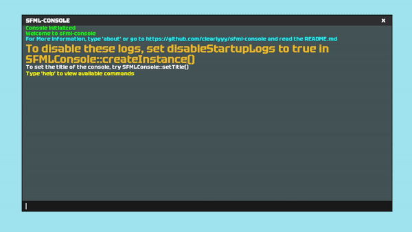

# sfml-console
## Single Header, Easy to use console library for SFML.

sfml-console is a lightweight, bloat-free in-game console designed specifically for SFML applications. Inspired by the powerful consoles found in games like Counter-Strike and Half-Life, it provides developers with a simple and intuitive way to add real-time debugging and command execution to their projects—with minimal setup and maximum flexibility.


### Installation
Simply just drag and drop SFMLConsole.hpp into your project, include it, and you have full access to the console.

### Usage

```c++
#include "SFMLConsole.hpp" // Include it in any file.

// Create the console instance and pass in your sf::RenderWindow
SFMLConsole& console = SFMLConsole::createInstance(window);

while (window.isOpen())
{
    sf::Event event;
    while (window.pollEvent(event))
    {
        // Call Update in your main SFML event loop
        console.Update(&event, window);
    }

    window.clear();
    // Then just draw it.
    console.Draw(window):
    window.display();
}

```

### Adding a command
There are two ways to add a command, which depends on whether or not the command needs to point to a function that has more parameters than just args.
```c++
SFMLConsole& console = SFMLConsole::createInstance(window);
// Add a command that points to a function which has no parameters other than args.
console.addCommand("myCommand", myFunction); // Still passing in args, but the function doesn't need any other variables passed in.

//Add a command that takes in arguments
console.addCommand("changeColor", [&](std::vector<std::string> args) {
    changeBGColor(args, bgColor); // Pass in bgColor
});
```

### Example
Here is a quick example of adding a command that changes the background/clear color for the SFML Scene.
```c++
// Here we change the background color
void changeBGColor(std::vector<std::string> args, sf::Color& bgColor) {
	SFMLConsole& console = SFMLConsole::getInstance();
	if (args.size() >= 3) {
		int r = std::stoi(args[0]);
		int g = std::stoi(args[1]);
		int b = std::stoi(args[2]);
		console.log("Changed Color to:" + std::to_string(r) + " " + std::to_string(g) + " " + std::to_string(b) + ".", sf::Color(r,g,b), 24);
		bgColor = sf::Color(r,g,b);
	}
	else {
		console.log("Command must have 3 parameters: r, g, b. eg. changeColor 255 147 244", sf::Color(163, 75, 72));
	}
}

// Now to use changeBGColor and take in r, g and b as arguments, 
// and pass in bgColor as a reference, we add it as a command using a lambda.
sf::Color bgColor;
console.addCommand("changeColor", [&](std::vector<std::string> args) {
    changeBGColor(args, bgColor); // Now we can pass in bgColor and change it.
});

// And now we set the background color of the window to bgColor in the game loop.
window.clear(bgColor);
```
Result



### Another Example

Here is just a simple command that spams the console, it needs no arguments or variables passed in.

```c++
// Here we spam the console
void spamConsole(std::vector<std::string> args) {
	SFMLConsole& console = SFMLConsole::getInstance();
	for (int i = 0; i < 500; i++) {
		console.log("Here is some spam", sf::Color::White);
	}
}
// Now we can add it as a command.
console.addCommand("spam", spamConsole);

// Even if spamConsole doesn't take in any arguments, you still need to specify the args as a parameter.
// If the function needs any other variables other than args, then the function must be done
// With a lambda like the changeBGColor example above.
```

### Useful functions

| Function | Description                                       |
|----------|---------------------------------------------------|
| createInstance(sf::RenderWindow& window, bool disableStartupLogs = false, bool floating = false) | Creates an instance of SFMLConsole.       |
| getInstance()    | Grabs the current instance of SFMLConsole |
| Update(sf::Event* event, sf::RenderWindow& window)         | Updates the console instance              |
| Draw(sf::RenderWindow& window)           | Draws the console                         | 
| forceResize()    | Forces the console to have a resize event |
| isConsoleVisible() | Returns the visibility of the console   |
| setVisibility(bool isConsoleVisible)  | Sets the visibility of the console        |
| addCommand(std::string cmd, std::function<void(std::vector<std::string>)> func)| Adds a command to the console instance    |
| log(std::string log, sf::Color color, float charSize = 16)| Creates a log |
| setTitle(std::string title) | Sets the title of the console window |
| setMaxLogs(size_t MAX_LOGS) | Sets the maximum amount of logs that can exist in the console at any given time |
| setSize(sf::Vector2f size) | Sets the size of the console |
| setSizeX, setSizeY, (float size) | Sets size of the console with a float |
| setBackgroundTransparency(float alpha) | Sets the transparency of the console window |
| setBackgroundColor(sf::Color color) | Sets the color of the console window


### Floating mode
The console may be set in floating mode (default) or fixed mode by setting floating to false in createInstance.


